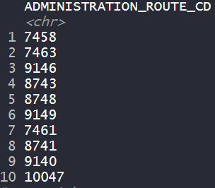

# .center["Real world software engineers are often faced with the challenge of moving quickly to ship new products or services, which can lead to a dilemma between *speed of execution* and *quality of engineering*."]

---

# Technical Debt

## Defined as the "cost" of the "speed vs. quality" tradeoff

* Convenient methods promote speed of development

* However, these methods tend to create compounding debt as the system grows in complexity

## Not all debt is bad
* Debt may be necessary in certain situations, especially in initial development of systems
 
* Important to be aware of sources of technical debt, as interest costs tend to compound with additional debt


---

# From a traditional software engineering perspective...

## Technical debt is usually related to code complexities or poor design, and may lead to increased maintenance costs
* Bug fixes
* Difficulty in making improvements/changes


---


# Technical debt can be paid off by

* Refactoring code, deleting dead code
* Improved unit testing
* Improved documentation
* Reducing dependencies

## The goal is NOT to add new functionality, but to improve the system (ease of future development/maintenance and reduction of bugs)

---

# From a machine learning (or modelling, more generally) perspective...


## Code complexities also exist
* Models built on code face similar code complexity issues as software code (particularly in data processing)

* E.g. a model pipeline uses multiple libraries, and one of the library's functions was altered, leading to different model calculations

### These issues can be addressed by traditional methods like code refactoring, dependency reduction, and unit testing.

---

# .center[Machine learning **systems** face different sets of challenges]

---


# Technical debt in machine learning systems

## System-level implications

* Slightly different model calculations can cause downstream, compounding effects

* E.g. The team detects change in model performance and decides that the problem is not worthwhile to fix, and stops using this model. Unbeknownst to them, another team's project depends on the output of this model as input to their own model.

### These issues may not be as obvious to detect.

---

# Types of system-level debt

### 1) Entanglement - "Changing anything changes everything"
* E.g. If you have features $x_1,...,x_n$ in a model, and the distribution of $x_1$ changes, or you want to add an additional feature $x_{n+1}$, this could cause the other features as well as the overall model to behave differently.

### 2) Hidden feedback loops 
* E.g. A model that predicts news headlines click through rate uses a feature called $x_{week}$ that counts the number of headlines a user clicked on in the past week.
* If this model improves CTR, users will begin to click on more headlines, thereby changing the input distribution.
* Over time, if the model is updated, the influence of $x_{week}$ on CTR may change, but the change could be slow and hard to detect.

---

# Types of system-level debt

### 3) Undeclared customers

* E.g. If another model uses predicted CTR as an input to determine the font size for the headline (bigger font size for headlines the user is more likely to click), then the font sizes may continually increase as CTR increases

* Also a hidden feedback loop

### 4) Data dependencies

* Unstable data sources can lead to unexpected, and sometimes difficult to identify issues

* E.g. An important model input is derived from a separate model that updates over time

* E.g. An input feature for your model is derived by a separate team, and the methodology used for derivation is changed via improvement updates and has unintended consequences for your own model

---

# Types of system-level debt

### 5) Pipeline jungles
* E.g. A data pipeline can consist of lots of "glue code" used for data scraping, data preprocessing, and merging. 

* Addition of new information sources can lead to messy code that resembles "a jungle of scrapes, joins, sampling steps, and intermediate files".

### 6) External world changes
* E.g. If two features are correlated, but only one is causal of the outcome, it is difficult to tease apart the contributions of each feature on the outcome. Weight is assigned to both and the model depends on the correlation within the training data.

* If there is a shift in the data, and these features are no longer correlated, the model performance can change significantly

---

# Real-life example

In the EDW Medication Administration Fact table, there is a variable that refers to medication administration route (oral, IV, subcutaneous, etc.)

Currently, this variable is represented by a numeric code, but may be translated to text in the future.



---

# Real-life example

At some point, this code will not work as intended, but the effects may not be obvious.

```{r eval = F}
med_route_iv <- ifelse(ADMINISTRATION_ROUTE_CD == 7458, 
                       "IV", "Non-IV")
```

---


# Methods to mitigate system-level debt

### 1) Identification/reduction of code complexity debt
* During development, make note of areas that you've incurred debt on, and keep track of things that can be refactored/reduced/eliminated

### 2) Identification/reduction of data dependency debt
* Mindfully balance the cost of including a data source with the gains in performance

---

# Methods to mitigate system-level debt

### 3) Using version control
* Code version control will help document changes
* Dependency version control (e.g. Docker) may be beneficial for production-level systems 
* Difficult to version control data, but can implement methods to detect qualitative changes

### 4) Monitoring and testing
* Unit tests can help with detecting individual problems that may affect the system
* Sophisticated monitoring systems can be developed to visualize behaviour/performance over time

### 5) Improving documentation


---

## .center["In practice, this all too often means that shipping the first version of a machine learning system is easy, but that making subsequent improvements is unexpectedly difficult. This consideration should be weighed carefully against deadline pressures for version 1.0 of any ML system."]


---

.center[]

# Unfortunately, that doesn't always work.
